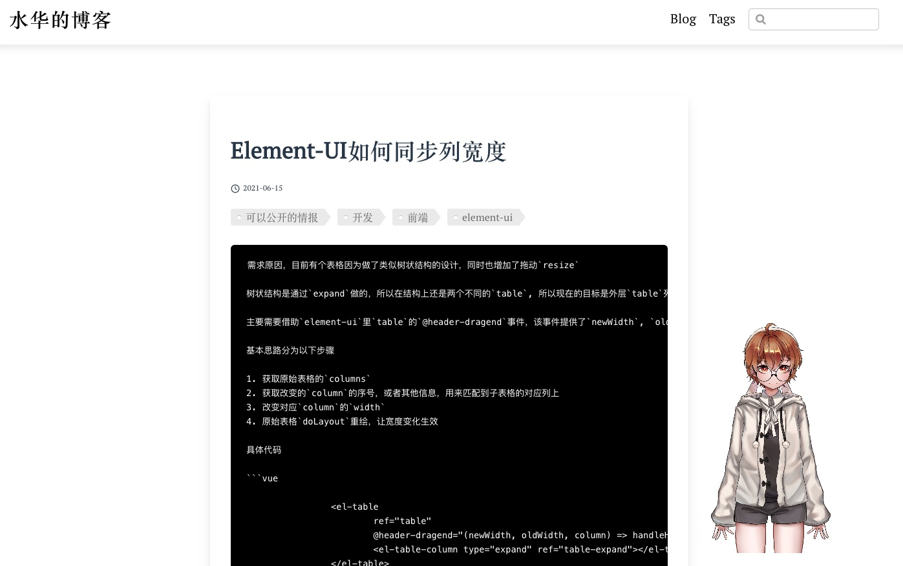

# vuepress live2d插件

感谢[vuepress-plugin-cat](https://github.com/QiShaoXuan/vuepress-plugin-cat/blob/master/cat.vue)给的灵感

因为我找了半天没有可以自定义`live2d`模型的插件，只能自己写了

**仅支持新版本的模型！**

## 预览


## 安装
```bash
npm i vuepress-plugin-live2d

or

yarn add vuepress-plugin-live2d
```

## 使用
在你的`config.js`中增加
```
module.exports = {
  plugins: [
      ['vuepress-plugin-live2d', { model: "你的模型地址" }]
  ]
}
```

## 其他参数
| 属性           | 类型    | 必填  | 默认  | 说明                                                                 |
|----------------|---------|-------|-------|----------------------------------------------------------------------|
| containerStyle | Object  | false | {}    | 给整个容器的样式，默认为右下角400 x 400的方框                        |
| model          | String  | true  | null  | model3.json的地址                                                    |
| mobile         | boolean | false | false | 是否在手机上显示                                                     |
| offsetX        | number  | false | 0     | 模型位置偏移，根据模型实际尺寸来，可能很大                           |
| offsetY        | number  | false | 0     | 模型位置偏移，根据模型实际尺寸来，可能很大                           |
| delay          | number  | false | 2000  | 受限于引入依赖库的问题，需要延迟加载模型，延迟的时间，建议至少大于1s |
| scale          | number  | false | 1     | 模型缩放                                                             |


